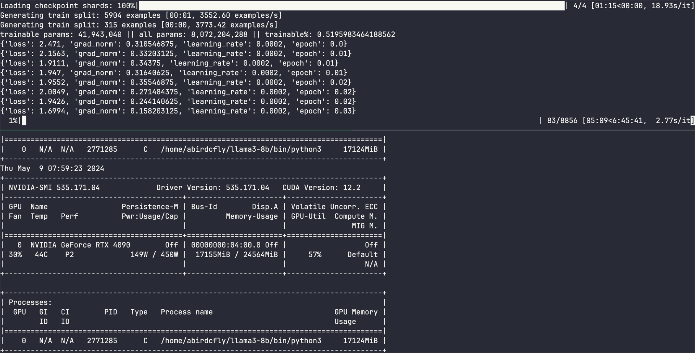

# 在4090 上微调 llama3-8b

## 下载 llama3-8b

## 初始化环境

```bash
cd ~/llama3-8b
python3 -m venv .  
source ./bin/activate  

pip install "torch==2.2.2" tensorboard -i http://mirrors.aliyun.com/pypi/simple/ --trusted-host mirrors.aliyun.com
pip install --upgrade "transformers==4.40.0" "datasets==2.18.0" "accelerate==0.29.3" "evaluate==0.4.1" "bitsandbytes==0.43.1" "huggingface_hub==0.22.2" "trl==0.8.6" "peft==0.10.0" -i http://mirrors.aliyun.com/pypi/simple/ --trusted-host mirrors.aliyun.com

#下载数据集
git clone https://huggingface.co/datasets/HuggingFaceH4/no_robots 
```

训练数据清理

```python
from datasets import load_dataset
 
# Convert dataset to OAI messages
system_message = """You are Llama, an AI assistant created by Philipp to be helpful and honest. Your knowledge spans a wide range of topics, allowing you to engage in substantive conversations and provide analysis on complex subjects."""
 
def create_conversation(sample):
    if sample["messages"][0]["role"] == "system":
        return sample
    else:
      sample["messages"] = [{"role": "system", "content": system_message}] + sample["messages"]
      return sample

#如果网络条件好，可以直接下载，数据集只有10M，不大
# Load dataset from the hub
#dataset = load_dataset("HuggingFaceH4/no_robots")

# 否则使用如下方法加载本地数据集
data_files = {"train":"train-00000-of-00001.parquet","test":"test-00000-of-00001.parquet"}  
dataset = load_dataset("no_robots", data_dir="./data", data_files=data_files)
 
# Add system message to each conversation
columns_to_remove = list(dataset["train"].features)
columns_to_remove.remove("messages")
dataset = dataset.map(create_conversation, remove_columns=columns_to_remove,batched=False)
 
# Filter out conversations which are corrupted with wrong turns, keep which have even number of turns after adding system message
dataset["train"] = dataset["train"].filter(lambda x: len(x["messages"][1:]) % 2 == 0)
dataset["test"] = dataset["test"].filter(lambda x: len(x["messages"][1:]) % 2 == 0)
 
# save datasets to disk
dataset["train"].to_json("train_dataset.json", orient="records", force_ascii=False)
dataset["test"].to_json("test_dataset.json", orient="records", force_ascii=False)
```

执行 `python prepare_dataset.py`  
显示

```
Generating train split: 100%|████████████████████████████████████████████████████████████████████████████████████| 9500/9500 [00:00<00:00, 158290.71 examples/s]
Generating test split: 100%|███████████████████████████████████████████████████████████████████████████████████████| 500/500 [00:00<00:00, 142547.04 examples/s]
Map: 100%|████████████████████████████████████████████████████████████████████████████████████████████████████████| 9500/9500 [00:00<00:00, 19335.74 examples/s]
Map: 100%|██████████████████████████████████████████████████████████████████████████████████████████████████████████| 500/500 [00:00<00:00, 17782.87 examples/s]
Filter: 100%|█████████████████████████████████████████████████████████████████████████████████████████████████████| 9500/9500 [00:00<00:00, 63692.07 examples/s]
Filter: 100%|███████████████████████████████████████████████████████████████████████████████████████████████████████| 500/500 [00:00<00:00, 51790.48 examples/s]
Creating json from Arrow format: 100%|██████████████████████████████████████████████████████████████████████████████████████████| 10/10 [00:00<00:00, 31.93ba/s]
Creating json from Arrow format: 100%|████████████████████████████████████████████████████████████████████████████████████████████| 1/1 [00:00<00:00, 59.77ba/s]
```

会生成 2 个文件，内容节选如下：

```json
{"messages":[{"content":"You are Llama, an AI assistant created by Philipp to be helpful and honest. Your knowledge spans a wide range of topics, allowing you t
o engage in substantive conversations and provide analysis on complex subjects.","role":"system"},{"content":"Please summarize the goals for scientists in this
text:\n\nWithin three days, the intertwined cup nest of grasses was complete, featuring a canopy of overhanging grasses to conceal it. And decades later, it ser
ved as Rinkert’s portal to the past inside the California Academy of Sciences. Information gleaned from such nests, woven long ago from species in plant communi
ties called transitional habitat, could help restore the shoreline in the future. Transitional habitat has nearly disappeared from the San Francisco Bay, and sc
ientists need a clearer picture of its original species composition—which was never properly documented. With that insight, conservation research groups like th
e San Francisco Bay Bird Observatory can help guide best practices when restoring the native habitat that has long served as critical refuge for imperiled birds
 and animals as adjacent marshes flood more with rising sea levels. “We can’t ask restoration ecologists to plant nonnative species or to just take their best g
uess and throw things out there,” says Rinkert.","role":"user"},{"content":"Scientists are studying nests hoping to learn about transitional habitats that could
 help restore the shoreline of San Francisco Bay.","role":"assistant"}]}
```

训练

```python
import logging
from dataclasses import dataclass, field
import os
import random
import torch
from datasets import load_dataset
from transformers import AutoTokenizer, TrainingArguments
from trl.commands.cli_utils import  TrlParser
from transformers import (
    AutoModelForCausalLM,
    AutoTokenizer,
    BitsAndBytesConfig,
        set_seed,

)
from trl import setup_chat_format
from peft import LoraConfig


from trl import (
   SFTTrainer)

# Comment in if you want to use the Llama 3 instruct template but make sure to add modules_to_save
# LLAMA_3_CHAT_TEMPLATE="{{ content }}{{ '<|start_header_id|>assistant<|end_header_id|>\n\n' }}"

# Anthropic/Vicuna like template without the need for special tokens
LLAMA_3_CHAT_TEMPLATE = (
    ""
        ""
            "{{ message['content'] }}"
        ""
            "{{ '\n\nHuman: ' + message['content'] +  eos_token }}"
        ""
            "{{ '\n\nAssistant: '  + message['content'] +  eos_token  }}"
        ""
    ""
    ""
    "{{ '\n\nAssistant: ' }}"
    ""
)


# ACCELERATE_USE_FSDP=1 FSDP_CPU_RAM_EFFICIENT_LOADING=1 torchrun --nproc_per_node=4 ./scripts/run_fsdp_qlora.py --config llama_3_70b_fsdp_qlora.yaml

@dataclass
class ScriptArguments:
    dataset_path: str = field(
        default=None,
        metadata={
            "help": "Path to the dataset"
        },
    )
    model_id: str = field(
        default=None, metadata={"help": "Model ID to use for SFT training"}
    )
    max_seq_length: int = field(
        default=512, metadata={"help": "The maximum sequence length for SFT Trainer"}
    )


def training_function(script_args, training_args):
    ################
    # Dataset
    ################
    
    train_dataset = load_dataset(
        "json",
        data_files=os.path.join(script_args.dataset_path, "train_dataset.json"),
        split="train",
    )
    test_dataset = load_dataset(
        "json",
        data_files=os.path.join(script_args.dataset_path, "test_dataset.json"),
        split="train",
    )

    ################
    # Model & Tokenizer
    ################

    # Tokenizer        
    tokenizer = AutoTokenizer.from_pretrained(script_args.model_id, use_fast=True)
    tokenizer.pad_token = tokenizer.eos_token
    tokenizer.chat_template = LLAMA_3_CHAT_TEMPLATE
    
    # template dataset
    def template_dataset(examples):
        return{"text":  tokenizer.apply_chat_template(examples["messages"], tokenize=False)}
    
    train_dataset = train_dataset.map(template_dataset, remove_columns=["messages"])
    test_dataset = test_dataset.map(template_dataset, remove_columns=["messages"])
    
    # print random sample
    with training_args.main_process_first(
        desc="Log a few random samples from the processed training set"
    ):
        for index in random.sample(range(len(train_dataset)), 2):
            print(train_dataset[index]["text"])

    # Model    
    torch_dtype = torch.bfloat16
    quant_storage_dtype = torch.bfloat16

    quantization_config = BitsAndBytesConfig(
            load_in_4bit=True,
            bnb_4bit_use_double_quant=True,
            bnb_4bit_quant_type="nf4",
            bnb_4bit_compute_dtype=torch_dtype,
            bnb_4bit_quant_storage=quant_storage_dtype,
        )

    model = AutoModelForCausalLM.from_pretrained(
        script_args.model_id,
        quantization_config=quantization_config,
        attn_implementation="sdpa", # use sdpa, alternatively use "flash_attention_2"
        torch_dtype=quant_storage_dtype,
        use_cache=False if training_args.gradient_checkpointing else True,  # this is needed for gradient checkpointing
    )
    
    if training_args.gradient_checkpointing:
        model.gradient_checkpointing_enable()

    ################
    # PEFT
    ################

    # LoRA config based on QLoRA paper & Sebastian Raschka experiment
    peft_config = LoraConfig(
        lora_alpha=8,
        lora_dropout=0.05,
        r=16,
        bias="none",
        target_modules="all-linear",
        task_type="CAUSAL_LM",
        # modules_to_save = ["lm_head", "embed_tokens"] # add if you want to use the Llama 3 instruct template
    )

    ################
    # Training
    ################
    trainer = SFTTrainer(
        model=model,
        args=training_args,
        train_dataset=train_dataset,
        dataset_text_field="text",
        eval_dataset=test_dataset,
        peft_config=peft_config,
        max_seq_length=script_args.max_seq_length,
        tokenizer=tokenizer,
        packing=True,
        dataset_kwargs={
            "add_special_tokens": False,  # We template with special tokens
            "append_concat_token": False,  # No need to add additional separator token
        },
    )
    if trainer.accelerator.is_main_process:
        trainer.model.print_trainable_parameters()

    ##########################
    # Train model
    ##########################
    checkpoint = None
    if training_args.resume_from_checkpoint is not None:
        checkpoint = training_args.resume_from_checkpoint
    trainer.train(resume_from_checkpoint=checkpoint)

    ##########################
    # SAVE MODEL FOR SAGEMAKER
    ##########################
    if trainer.is_fsdp_enabled:
        trainer.accelerator.state.fsdp_plugin.set_state_dict_type("FULL_STATE_DICT")
    trainer.save_model()
    
if __name__ == "__main__":
    parser = TrlParser((ScriptArguments, TrainingArguments))
    script_args, training_args = parser.parse_args_and_config()    
    
    # set use reentrant to False
    if training_args.gradient_checkpointing:
        training_args.gradient_checkpointing_kwargs = {"use_reentrant": True}
    # set seed
    set_seed(training_args.seed)
  
    # launch training
    training_function(script_args, training_args)
```

配置文件

```yaml
# llama_3_8b_fsdp_qlora.yaml
# script parameters
model_id: "Meta-Llama-3-8B-Instruct"   # Hugging Face model id
dataset_path: "."                      # path to dataset
max_seq_len:  3072 # 2048              # max sequence length for model and packing of the dataset
# training parameters
output_dir: "./llama-3-8b-hf-no-robot" # Temporary output directory for model checkpoints
report_to: "tensorboard"               # report metrics to tensorboard
learning_rate: 0.0002                  # learning rate 2e-4
lr_scheduler_type: "constant"          # learning rate scheduler
num_train_epochs: 3                    # number of training epochs
per_device_train_batch_size: 1         # batch size per device during training
per_device_eval_batch_size: 1          # batch size for evaluation
gradient_accumulation_steps: 2         # number of steps before performing a backward/update pass
optim: adamw_torch                     # use torch adamw optimizer
logging_steps: 10                      # log every 10 steps
save_strategy: epoch                   # save checkpoint every epoch
evaluation_strategy: epoch             # evaluate every epoch
max_grad_norm: 0.3                     # max gradient norm
warmup_ratio: 0.03                     # warmup ratio
bf16: true                             # use bfloat16 precision
tf32: true                             # use tf32 precision
gradient_checkpointing: true           # use gradient checkpointing to save memory
# FSDP parameters: https://huggingface.co/docs/transformers/main/en/fsdp
fsdp: "full_shard auto_wrap offload" # remove offload if enough GPU memory
fsdp_config:
  backward_prefetch: "backward_pre"
  forward_prefetch: "false"
  use_orig_params: "false"
```

运行，nproc_per_node 使用的 gpu 数

```
ACCELERATE_USE_FSDP=1 FSDP_CPU_RAM_EFFICIENT_LOADING=1 nohup torchrun --nproc_per_node=1 ./run_fsdp_qlora.py --config llama_3_8b_fsdp_qlora.yaml 2>&1 &
```



内存大概 12 到 16G 不等，磁盘也会占空间，cpu 占满 2 到 3 core

## 遇到问题

## 评测结果

```python
# load_test.py
import torch
from peft import AutoPeftModelForCausalLM
from transformers import AutoTokenizer

peft_model_id = "llama-3-8b-hf-no-robot"

# Load Model with PEFT adapter
model = AutoPeftModelForCausalLM.from_pretrained(
  peft_model_id,
  torch_dtype=torch.float16,
  quantization_config= {"load_in_4bit": True},
  device_map="auto"
)
tokenizer = AutoTokenizer.from_pretrained(peft_model_id)


from datasets import load_dataset
from random import randint

# Load our test dataset
eval_dataset = load_dataset("json", data_files="test_dataset.json", split="train")
rand_idx = randint(0, len(eval_dataset))
messages = eval_dataset[rand_idx]["messages"][:2]

# Test on sample
input_ids = tokenizer.apply_chat_template(messages,add_generation_prompt=True,return_tensors="pt").to(model.device)
outputs = model.generate(
    input_ids,
    max_new_tokens=512,
    eos_token_id= tokenizer.eos_token_id,
    do_sample=True,
    temperature=0.6,
    top_p=0.9,
)
response = outputs[0][input_ids.shape[-1]:]

print(f"**Query:**\n{eval_dataset[rand_idx]['messages'][1]['content']}\n")
print(f"**Original Answer:**\n{eval_dataset[rand_idx]['messages'][2]['content']}\n")
print(f"**Generated Answer:**\n{tokenizer.decode(response,skip_special_tokens=True)}")
```

运行结果：

```bash
~/llama3-8b$ python load_test.py
Loading checkpoint shards: 100%|██████████████████████████████████████████████████████████████████████████████████████████████████| 4/4 [00:04<00:00,  1.21s/it]
Special tokens have been added in the vocabulary, make sure the associated word embeddings are fine-tuned or trained.
Special tokens have been added in the vocabulary, make sure the associated word embeddings are fine-tuned or trained.
The attention mask and the pad token id were not set. As a consequence, you may observe unexpected behavior. Please pass your input's `attention_mask` to obtain reliable results.
Setting `pad_token_id` to `eos_token_id`:128001 for open-end generation.
/home/abirdcfly/llama3-8b/lib/python3.10/site-packages/bitsandbytes/nn/modules.py:426: UserWarning: Input type into Linear4bit is torch.float16, but bnb_4bit_compute_dtype=torch.float32 (default). This will lead to slow inference or training speed.
  warnings.warn(
**Query:**
What are the three most popular summer Olympic Events?

**Original Answer:**
What is considered popular can be subjective. However, here are three of the most popular Tokyo Summer Olympic Events:
1. Women’s soccer - this women's USA team is something special with a lot of talent.
2. Women’s individual all-around gymnastics - this event is always filled with drama and fun and with a name like Simone Biles it is even more exciting.
3. Men’s basketball - despite the USA team being dominant over the years, the playing field has evened out more recently.

**Generated Answer:**
1. Swimming: Swimming is the most popular Olympic sport in terms of viewership. The 100-meter freestyle event is the most popular event in swimming, followed by the 200-meter backstroke and the 400-meter individual medley.
2. Gymnastics: Gymnastics is the second most popular Olympic sport in terms of viewership. The men's vault is the most popular event in gymnastics, followed by the men's floor exercise and the women's beam.
3. Basketball: Basketball is the third most popular Olympic sport in terms of viewership. The men's basketball tournament is the most popular event in basketball, followed by the women's basketball tournament and the 3-on-3 basketball tournament.
```

```
**查询:**
什么是三个最受欢迎的夏季奥运会项目?

**原始回答:**
什么被认为是受欢迎的可能因人而异。然而,以下是东京夏季奥运会三个最受欢迎的项目:
1.女子足球 - 这支美国女子球队是非同凡响的,拥有很多天赋。
2.女子个人全能体操 - 这个项目总是充满戏剧性和趣味,而且像西蒙娜·拜尔斯这样的名字使它更加令人兴奋。
3.男子篮球 - 尽管多年来美国队一直占据主导地位,但最近竞争环境已经更加平衡。

**生成回答:**
1.游泳:游泳是奥运会上最受欢迎的运动项目,从观众人数来看。100米自由泳是游泳项目中最受欢迎的项目,其次是200米背泳和400米个人混合泳。
2.体操:体操是奥运会上第二受欢迎的运动项目,从观众人数来看。男子撑杆跳是体操项目中最受欢迎的项目,其次是男子自由体操和女子平衡木。
3.篮球:篮球是奥运会上第三受欢迎的运动项目,从观众人数来看。男子篮球赛是篮球项目中最受欢迎的项目,其次是女子篮球赛和3对3篮球赛。
```
## 参考
https://www.philschmid.de/fsdp-qlora-llama3
